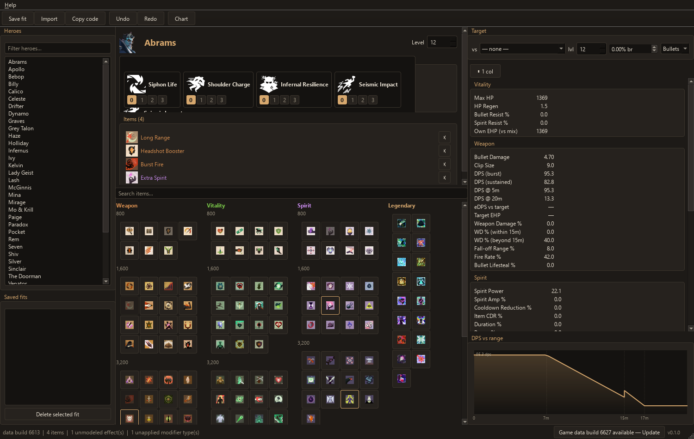

<div align="center">
  

# Pyba

A build simulator for Deadlock.

[](https://github.com/gentle-packet/Pyba/releases/latest)
[](https://github.com/gentle-packet/Pyba/actions)
[](https://github.com/gentle-packet/Pyba/releases)
[](LICENSE)


[Download](https://github.com/gentle-packet/Pyba/releases/latest) · [Report a bug](https://github.com/gentle-packet/Pyba/issues) · [deadlock-eos engine](https://github.com/gentle-packet/deadlock-eos)


</div>

Pyba is a build simulator for Deadlock. Pick a hero, buy items, set ability
tiers, and it shows the resulting stats and where each number comes from.
The calculations live in a separate library,
[deadlock-eos](https://github.com/gentle-packet/deadlock-eos); Pyba is the
desktop app.

## Features

- Full shop, including legendary items from street brawl
- The shop works like in game: components you own count toward the upgrade price
- Hover a stat to see which items and abilities contribute to it
- Hover a shop item to preview what it would change before buying
- DPS-vs-range chart with falloff and range gates (Long Range shows its step at 15 m)
- Import any published in-game build by its id, via [deadlock-api](https://deadlock-api.com)
- Save fits locally or share them as short `PYBA1.` codes
- Item win rates in the shop
- Undo/redo

## Download

Get `Pyba-<version>-win64.zip` from the
[Releases](https://github.com/gentle-packet/Pyba/releases) page. Extract it
anywhere and run `Pyba\Pyba.exe`. No Python install needed. Everything works
offline except item icons and win rates.

Each release bundles a snapshot of the Deadlock game data. When a new game
build comes out, an update button shows up in the status bar. Help → *Check
for game data updates* does the same thing, and *Revert to bundled game
data* undoes it. You can also drop a dump into `%APPDATA%\Pyba\dumps\<build>\`
by hand; it takes precedence over the bundled one.

## Reporting bugs

Open an [issue](https://github.com/gentle-packet/Pyba/issues). Include the
app version and game data build from the status bar, and ideally a `PYBA1.`
share code of the build that shows the problem. Mention your Windows
version, and anything unusual about where the app or `%APPDATA%` lives:
OneDrive-synced folder, network drive, non-NTFS partition, restricted
permissions. The fit library, caches, and game data dumps are plain files
under `%APPDATA%\Pyba`, so filesystem quirks can affect them.

## Development

### Running from a checkout

```
python -m venv .venv
.venv\Scripts\pip install -e ..\deadlock-eos -e .
.venv\Scripts\python -m pyba.ui
```

Requires Python 3.12+ and a sibling checkout of deadlock-eos (that repo
carries the game data snapshots).

### Layout

- `src/pyba/port/` — imports published in-game builds and converts them to
  engine `Build` objects
- `src/pyba/fits.py` — fit save/load as plain JSON
- `src/pyba/service/` — the only layer with side effects: game data
  discovery and updates, the fit library under `%APPDATA%/Pyba`, `PYBA1.`
  share codes, win rate analytics
- `src/pyba/ui/` — the PySide6 app. Every change goes through
  `BuildSession` in `session.py`. Widgets are in `views/`, colors in
  `theme.py`

### Tests

```
.venv\Scripts\pip install -e ..\deadlock-eos -e ".[dev]"
.venv\Scripts\python -m pytest
```

Tests run offline: a real build payload is committed under `tests/fixtures/`
and game data comes from the sibling deadlock-eos checkout (override with
`DEADLOCK_EOS_DATA`). UI tests skip when PySide6 is not installed. To check
UI changes without a display, see `.claude/skills/verify/SKILL.md`.

### Contributing

Run the tests before opening a PR. For anything bigger than a fix, open an
issue first. Stat math lives in deadlock-eos, so wrong numbers usually get
fixed there.

### Releasing

1. Bump `__version__` in `src/pyba/__init__.py` (pyproject reads it via
   hatch dynamic versioning).
2. Validate locally: `.\packaging\build-local.ps1`, then launch
   `dist\Pyba\Pyba.exe` and click around.
3. Commit, push, then tag: `git tag v<version> && git push origin v<version>`.
   GitHub Actions builds the onedir zip (bundling deadlock-eos and the game
   data), smoke-tests the frozen exe, and attaches it to a GitHub Release.
   The workflow needs the `EOS_REPO_TOKEN` repo secret, a fine-grained PAT
   with Contents: read on `gentle-packet/deadlock-eos`. Rotate it when it
   expires.

## Credits

App icon by [@zed_too](https://twitter.com/zed_too).
Game data from [deadlock-api](https://deadlock-api.com).
Project heavily inspired by [pyfa](https://github.com/pyfa-org/Pyfa) and
[Path of Building](https://github.com/PathOfBuildingCommunity/PathOfBuilding).
